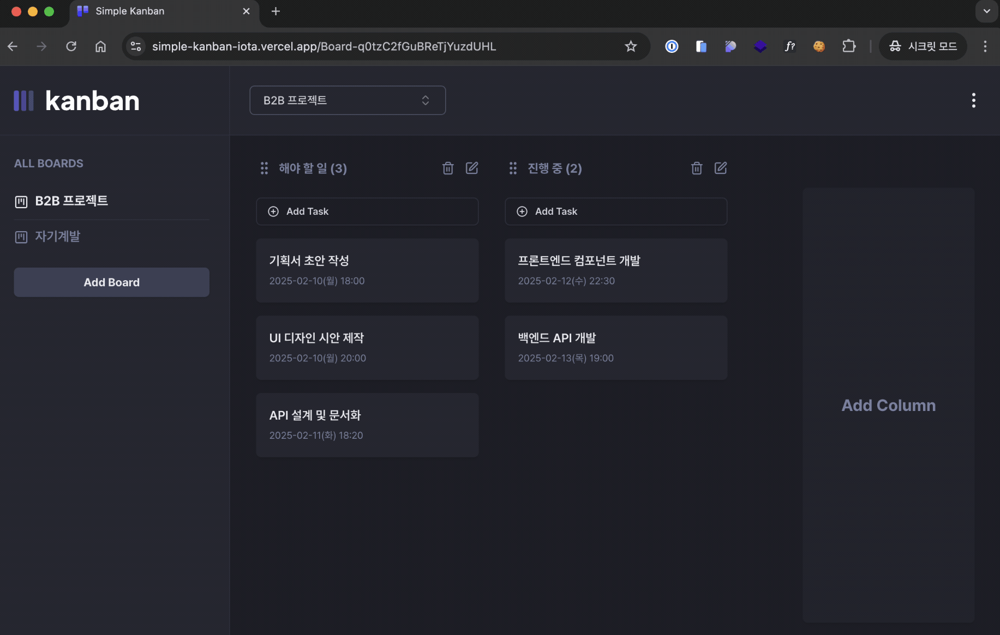
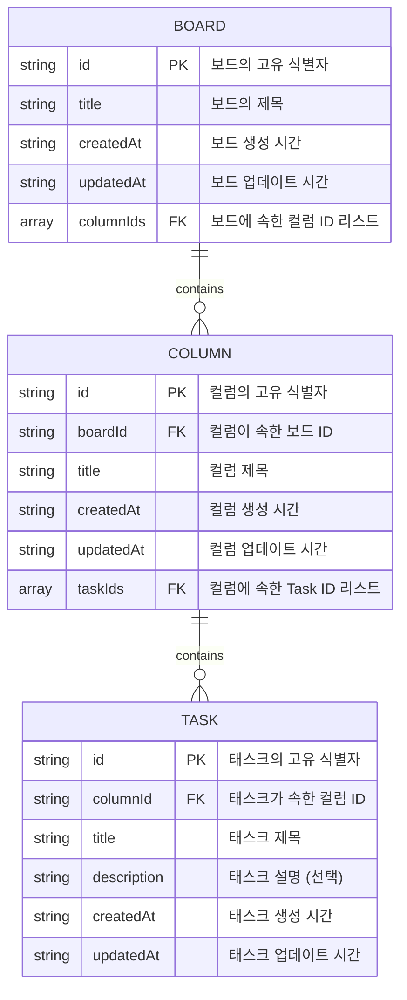
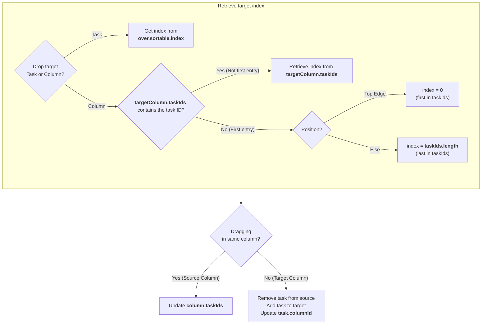
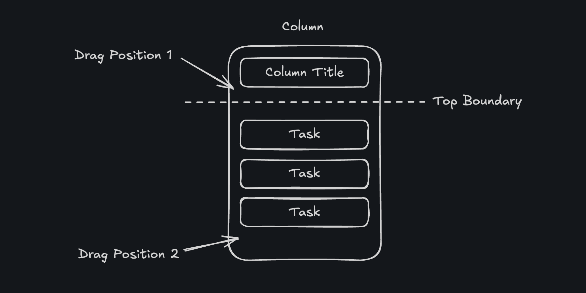
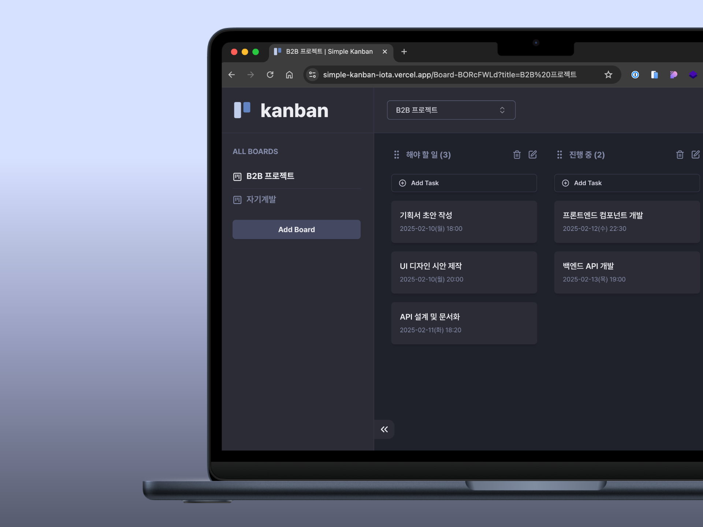

# Simple Kanban



> 데모 사이트: https://simple-kanban-iota.vercel.app

## 기술 스택

- **코어:** Next.js, TypeScript
- **상태 관리:** Zustand
- **UI:** Shadcn
- **스타일링:** Tailwind CSS
- **린팅:** ESLint, Prettier
- **폼 관리:** React Hook Form, Zod
- **기타:** DnD Kit, Motion

## 주요 기능

1. 보드(Board): 추가, 삭제
2. 컬럼(Column): 추가, 삭제, 이름 변경
3. 작업(Task): 추가, 삭제, 이름/상세정보 변경
4. 컬럼/작업 드래그앤드롭 이동 (드롭 대상 영역 Placeholder 표시)
5. 보드 검색 커맨드 (헤더)
6. 모바일 대응

## 구현 과정 목차

- [칸반 데이터 모델](#칸반-데이터-모델)
- [드래그앤드롭](#드래그앤드롭)
- [컬럼 순서 변경](#컬럼-순서-변경)
- [태스크 순서 변경 / 컬럼 간 이동](#태스크-순서-변경--컬럼-간-이동)
  - [컬럼 ID 확인](#컬럼-id-확인)
  - [아이템 인덱스 확인](#아이템-인덱스-확인)
  - [드래그 아이템 Y 좌표 계산](#드래그-아이템-Y-좌표-계산)
- [센서 조정](#센서-조정)
- [이슈 해결](#이슈-해결)
  - [하이드레이션 에러](#하이드레이션-에러)
  - [무한 루프](#무한-루프)

## 칸반 데이터 모델

ID 기반 참조 구조를 사용하면 엔티티 간 관계를 유지하면서 빠른 조회 성능을 보장할 수 있다. 각 엔티티는 고유한 `id`를 가지며, 외래 키(`boardId`, `columnId`)를 사용하여 참조 무결성을 유지한다. 칸반 보드는 여러 개의 컬럼을 포함하고, 각 컬럼은 다시 여러개의 태스크로 구성되는 계층적인 구조를 가진다.



- `Record<TaskId, TaskFields>` 형태로 저장하면 O(1) 시간 복잡도로 데이터 조회 가능
- `boardId`, `columnId` 같은 FK(Foreign Key, 외래 키)를 사용하여 참조 무결성 보장
- 필요에 따라 `assigneeId`, `priority` 같은 필드를 쉽게 추가할 수 있음

## 드래그앤드롭

리스트를 `SortableContext`로 감싸고, 리스트의 각 아이템에 `useSortable` 훅 반환값을 적용하면 드래그앤드롭으로 아이템 순서를 변경 할 수 있다. 참고로 `useSortable` 훅은 `useDraggable`, `useDroppable` 훅을 결합하여 만든 프리셋이다.

- SortableContext: 리스트 순서 관리
- useSortable: 드래그앤드롭 기능 부여, 아이템 위치 변화에 필요한 상태와 이벤트 핸들러 제공.

Task는 부모 컨테이너(속해있는 컬럼)를 벗어나 다른 컬럼으로 이동할 수 있어야 하므로, 드래그 아이템을 `DragOverlay`로 감싸야 한다. `DragOverlay`는 기존 문서 흐름에서 분리되어 뷰포트를 기준으로 드래그 가능한 오버레이를 렌더링한다.

```tsx
// ...
import { DndContext, DragOverlay } from '@dnd-kit/core';
import { SortableContext } from '@dnd-kit/sortable';

const Board = () => {
  // ...
  // onDragStart, onDragEnd 등 핸들러 로직을 정의한 커스텀 훅
  const { handlers, dragColumnId, dragTaskId, /* ... */ } = useKanbanDnd();

  return (
    <div className="...">
      {/* 리스트를 DndContext, SortableContext로 감싸준다 */}
      <DndContext {...handlers} id={...} sensors={...} modifiers={...}>
        <SortableContext items={board.columnIds} id={board.id}>
          {board.columnIds.map((columnId) => (
            <Column key={columnId} columnId={columnId} />
          ))}
        </SortableContext>
        <DragOverlay>
          {/* 드래그 중인 아이템 */}
          {dragColumnId && <Column columnId={toColumnId(dragColumnId)} />}
          {dragTaskId && <Task taskId={toTaskId(dragTaskId)} />}
        </DragOverlay>
      </DndContext>
    </div>
  );
};
```

드래그를 시작할 때 현재 요소가 컬럼인지 태스크인지 판별한 후, `DragOverlay`에서 조건부 렌더링해야 한다. 이를 위해 `onDragStart` 핸들러에서 각 타입(task, column)에 해당하는 `id`를 별도 상태로 관리한다.

```tsx
// use-drag-state.ts
const [dragColumnId, setDragColumnId] = useState<T>();
const [dragTaskId, setDragTaskId] = useState<T>();

const setDragState = useCallback((type: 'task' | 'column', value: T) => {
  const setStateMap = { task: setDragTaskId, column: setDragColumnId };
  setStateMap[type](value);
}, []);

// use-kanban-dnd.ts
const onDragStart = ({ active }: DragStartEvent) => {
  const dragType = getDragTypes(active).isActiveTask ? 'task' : 'column';
  setDragState(dragType, active.id);
};
```

리스트 아이템에선 `useSortable` 훅이 반환하는 값들을 드래그 대상 요소에 적용한다. `useSortable` 훅이 받는 `id`, `data` 등 인자는 이벤트 핸들러로 전달된다(active, over 속성에 추가됨).

전체 요소가 아닌 특정 부분을 클릭했을때만 드래그되도록 하고 싶다면 `listeners` 핸들러를 다른 요소에 할당하면 된다. 기본적으로 드롭 지점에 드래그 대상 요소가 그대로 렌더링된다. 테두리만 보이거나 특정 스타일을 적용하고 싶다면 `isDragging` 상태를 활용해서 조건부 렌더링으로 처리하면 된다.

```tsx
// ...
import { CSS } from '@dnd-kit/utilities';
import { useSortable } from '@dnd-kit/sortable';

const Column = ({ boardId, children }) => {
  const {
    attributes, // 접근성을 위한 ARIA 속성 (드래그 요소에 적용)
    listeners, // 드래그 시작을 감지하는 이벤트 핸들러
    setNodeRef, // 요소를 드래그 대상으로 설정하는 ref 함수
    transform, // 드래그 요소의 위치 변화를 나타내는 값 (x, y, scaleX, scaleY)
    transition, // 드래그 요소의 애니메이션 효과를 적용하는 값
    isDragging, // 현재 요소가 드래그 중인지 여부 boolean
  } = useSortable({
    id: boardId, // 아이템의 고유 ID
    data: { type: 'column' }, // 전달할 데이터
  });

  const style: CSSProperties = {
    transform: CSS.Transform.toString(transform), // 위치 이동 스타일 적용
    transition, // 애니메이션 효과 적용
  };

  if (isDragging) {
    // 드래그 중일 때 드롭 영역에 표시할 Placeholder
    return <DropPlaceholder variant={type} style={style} ref={setNodeRef} />;
  }

  return (
    <div ref={setNodeRef} style={style} {...listeners} {...attributes}>
      {children}
    </div>
  );
};
```

💡 내부에서 `useSortable` 훅을 호출하는 [Draggable](https://docs.dndkit.com/api-documentation/draggable) 공통 컴포넌트를 만들어서 사용하면 코드가 깔끔해진다.

## 컬럼 순서 변경

컬럼의 컨테이너는 항상 Board이므로 아이템을 드롭했을 때 호출되는 `onDragEnd` 핸들러에서 처리할 수 있다. 핸들러의 인자로 전달되는 `active`는 드래그 중인 아이템을, `over`는 드롭 위치의 컨테이너를 참조한다.

```tsx
const onDragEnd = ({ active, over }: DragEndEvent) => {
  // 드래그 중인 아이템이 DragOverlay에서 렌더링 되지 않도록 dragColumnId, dragTaskId 초기화
  // 하단에 early return 있으므로 최상단에서 초기화
  resetDragState();

  if (!over) return; // 드롭 영역 벗어났을 때
  if (active.id === over?.id) return; // 같은 위치는 스킵
  if (!getDragTypes(active).isActiveColumn) return; // Column 드래그가 아니면 스킵

  const activeSort = active.data.current?.sortable as ColumnSortable;
  const overSort = over?.data.current?.sortable as ColumnSortable;

  // arrayMove는 dnd-kit 자체적으로 제공하는 헬퍼 함수
  const newColumnIds = arrayMove(activeSort.items, activeSort.index, overSort.index);
  moveColumn(activeSort.containerId, newColumnIds);
};
```

Sortable 프리셋을 사용하면 `active`, `over` 객체에 `sortable`이라는 유용한 속성이 추가된다. 이 속성을 활용하면 드래그 중인 아이템이 속한 컨테이너 ID, 인덱스, 컨테이너 내의 전체 아이템 목록을 바로 참조할 수 있어서 코드를 더 간결하게 작성할 수 있다.

```js
// active
const active = {
  id: 'Column-rYZJ5DsW8WyWUrIZ-tN9p', // 현재 아이템 id (useSortable 인자로 넘겼던 id)
  data: {
    current: {
      sortable: {
        // 현재 아이템이 속한 컨테이너 ID (SortableContext에 넘겼던 id)
        containerId: 'Board-q0tzC2fGuBReTjYuzdUHL',
        // 컨테이너 내에서 현재 아이템의 인덱스
        index: 0,
        // 컨테이너의 전체 아이템 목록 (SortableContext에 넘겼던 items)
        items: [
          'Column-rYZJ5DsW8WyWUrIZ-tN9p', // 현재 아이템
          'Column-uh6jGsYnCfu3peUX5ZF-O',
        ],
      },
      // ...
      type: 'column', // 현재 아이템 type (useSortable 인자로 넘겼던 type)
    },
  },
  // ...
};
```

💡 dnd-kit 라이브러리 자체적으로 `arraySwap`, `arrayMove` 유틸리티 함수를 제공한다. `arraySwap`은 배열 내 두 요소의 위치를 교환하고, `arrayMove`는 지정한 인덱스로 요소를 이동시킨 후 나머지 요소를 밀어낸다.

```tsx
import { arraySwap, arrayMove } from '@dnd-kit/sortable';

const items = ['A', 'B', 'C', 'D'];
const swapped = arraySwap(items.slice(), 1, 3); // 인덱스 1(B)와 3(D) 교환
const moved = arrayMove(items.slice(), 1, 3); // 인덱스 1(B)을 인덱스 3 위치로 이동

console.log(swapped); // ['A', 'D', 'C', 'B']
console.log(moved); // ['A', 'C', 'D', 'B']
```

## 태스크 순서 변경 / 컬럼 간 이동

컬럼을 넘나드는 태스크 이동은 `onDragEnd` 이벤트 핸들러에서 처리할 수 없다. 예를들어 A 컬럼(컨테이너)에 있던 태스크를 B 컬럼으로 드래그하면, 드롭해서 `onDragEnd` 핸들러가 호출되기 전까진 어느 컬럼으로 이동했는지 감지할 수 없다. 때문에 드롭 영역이 다른 컨테이너라면 Placeholder UI가 렌더링 되지 않는다.

UI를 즉시 반영하려면 태스크를 컬럼 영역으로 드래그할 때마다, 해당 컬럼의 아이템 목록을 업데이트해야 한다. 이를 위해 드래그 중인 아이템이 드롭 컨테이너 위로 이동할 때마다 호출되는 `onDragOver` 이벤트를 활용한다.

```tsx
const onDragOver = ({ active, over, delta, activatorEvent }: DragOverEvent) => {
  if (!over) return; // 드롭 영역 벗어났을 때
  if (active.id === over.id) return; // 같은 위치는 스킵

  const { isActiveTask, isOverTask, isOverColumn } = getDragTypes(active, over);

  if (!isActiveTask) return; // Task 드래그가 아니면 스킵

  const activeSort = active.data.current?.sortable as TaskSortable;
  const overSort = over.data.current?.sortable as TaskSortable;

  const sourceTaskId = toTaskId(active.id);
  const sourceTaskIdx = activeSort.index; // 드래그를 시작한 카드의 인덱스

  const sourceColumnId = activeSort.containerId;
  // 드롭 영역이 Task 카드이면 해당 카드의 컨테이너는 컬럼이므로 overSort.containerId 에서 ID 획득
  // 드롭 영역이 컬럼이면 over 자체는 컬럼을 참조하므로 over.id 에서 ID 획득
  const targetColumnId = isOverTask ? overSort.containerId : toColumnId(over.id);
  const targetColumn = columns[targetColumnId];

  // 드래그 시작 위치(clientY)와 이동 거리(delta.y)를 합산해서 현재 Y 위치 계산
  const currentY = (activatorEvent as MouseEvent).clientY + delta.y;

  // 드롭 대상 카드의 인덱스 (computeTargetTaskIdx 함수 설명은 아래 내용 참고)
  const targetTaskIdx = computeTargetTaskIdx({
    isOverColumn,
    targetColumn,
    overSort,
    sourceTaskId,
    currentY,
  });

  moveTask({
    sourceTaskId,
    sourceColumnId,
    targetColumnId,
    sourceTaskIdx,
    targetTaskIdx,
  });
};
```

태스크를 드래그했을 때 드롭 지점은 ❶"컬럼 영역 위"(컬럼에 태스크가 없거나 컬럼내 다른 공간에 위치), ❷"해당 컬럼의 다른 태스크 위" 이렇게 두 가지 경우로 나뉘며, 각 상황에 따라 처리 방식이 달라진다. 또한 태스크를 드래그할 때마다 아래 3가지 상태를 업데이트해야 한다.

1. 드래그 아이템의 `task.columnId` (변경된 컬럼 ID로 교체)
2. 드래그 중인 아이템이 속했던 컬럼의 `column.taskIds`
   1. 동일 컬럼 내에서 드래그했다면 인덱스 순서만 변경
   2. 다른 컬럼으로 드래그했다면 해당 태스크 ID 제거
3. 드롭 대상 컬럼의 `column.taskIds` (인덱스 순서 변경)

위 상태를 업데이트하기 위해선 소스 컬럼 ID, 타겟 컬럼 ID, 드래그 아이템(태스크) ID, 컬럼 내에서 순서를 변경할 두 아이템(소스/타겟 태스크)의 인덱스 정보를 확인해야 한다.

### 컬럼 ID 확인

1. 소스 컬럼 ID: `active` 객체의 `sortable.containerId`
2. 타겟 컬럼 ID:
   1. 드롭 대상 - 태스크: `over` 객체의 `sortable.containerId` (태스크의 컨테이너는 컬럼이므로)
   2. 드롭 대상 - 컬럼: `over.id` (이때 `over` 객체는 컬럼을 참조하므로)

### 아이템 인덱스 확인

1. 소스 태스크(드래그 아이템): `active` 객체 `sortable.index`
2. 타겟 태스크(드롭 영역에 위치한 아이템) 3. 드롭 대상이 태스크일 때: `over` 객체 `sortable.index` 4. 드롭 대상이 컬럼 영역일 때 (컬럼에 카드가 없거나, 컬럼 위/아래쪽 위치)
   1. [첫 진입이 아닐 때] 컬럼.아이템 목록에 드래그 아이템 ID 有 → 조회한 인덱스 반환
   2. [첫 진입일 때] 컬럼.아이템 목록에 드래그 아이템 ID 無
      - 대상 컬럼의 첫 번째 태스크보다 위쪽으로 드래그했을 때: 첫 번째 위치 (인덱스 = `0`)
      - 그 외 상황: 마지막 위치 (인덱스 = `taskIds.length`)

타겟 태스크의 인덱스 확인 과정을 플로우차트로 시각화해보면 다음과 같다.



### 드래그 아이템 Y 좌표 계산

`onDragOver` 핸들러는 `delta`, `activatorEvent` 객체를 인자로 받는다. `activatorEvent.clientY`는 드래그를 시작했을 때 y 좌표를 나타내고, `delta.y`는 이동한 거리를 나타낸다. 이 두 값을 더하면 현재 드래그 중인 아이템의 y 좌표를 계산할 수 있다.



위 이미지의 Top Boundary는 첫 번째 태스크 위쪽의 경계를 의미한다. 만약 계산한 y 좌표가 이 경계보다 작으면(Drag Position 1) 드래그 아이템을 첫 번째 아이템으로 위치시키고(인덱스 = 0), 그 외엔(Drag Position 2) 마지막 아이템(taskIds.length)으로 위치시킨다.

```tsx
export const computeTargetTaskIdx = ({
  isOverColumn,
  targetColumn,
  overSort,
  sourceTaskId,
  currentY,
  topBoundary = 200,
}: ComputeTargetTaskIdxParams): number => {
  // 드롭 대상이 태스크일 때
  if (!isOverColumn) return overSort.index;

  // 드롭 대상이 컬럼 영역일 때 (컬럼에 카드가 없거나 컬럼 위/아래쪽 위치)
  const index = targetColumn.taskIds.indexOf(sourceTaskId);
  // 컬럼 영역 진입 → 첫번째/마지막 위치의 인덱스로 대상 컬럼의 아이템 목록을 업데이트한 상태에서 다시 움직였을 때
  if (index !== -1) return index;

  // 대상 컬럼의 첫번째 카드 위치보다 위로 드래그 했을 땐 첫번째로, 그 외엔 마지막 인덱스로 설정
  return currentY < topBoundary ? 0 : targetColumn.taskIds.length;
};
```

## 센서 조정

- 패닝(Panning): 화면을 터치한 상태에서 드래그하여 이동하는 제스처
- 핀치줌(Pinch Zoom): 두 손가락을 모으거나 벌려서 화면을 축소/확대하는 제스처

dnd-kit의 센서(sensor)는 드래그앤드롭 상호작용을 감지하고 제어하는 추상화 레이어다. 기본적으로 Pointer, Keyboard 센서가 활성화되며, `useSensors` 훅을 통해 다른 센서로 변경할 수 있다. `delay`, `distance` 같은 제약 조건을 추가해서 드래그 활성을 방지할 수도 있다.

만약 드래그 핸들(listeners가 할당되어 있는 요소) 안에 버튼이 있다면, 클릭하는 순간 드래그가 활성화돼서 버튼 클릭이 불가능해진다. `distance` 제약 조건을 추가하면 이러한 문제를 해결할 수 있다.

모바일은 Touch 센서의 `delay`, `tolerance` 제약 조건을 추가해서 일정 시간 이상 터치해야만 드래그가 활성화되도록 할 수 있다. 일반적인 롱프레스 대기 시간은 250ms가 적당하다.

Pointer 센서는 데스크톱 클릭과 모바일 터치 이벤트도 함께 처리하기 때문에 데스크톱, 모바일 다른 제약 조건을 적용하려면 Mouse, Touch 센서를 각각 사용해야 한다.

```tsx
// 데스크톱 최적화
const mouseSensor = useSensor(MouseSensor, {
  activationConstraint: {
    // 드래그 시작을 위해 요소 클릭 후 커서를 이동시켜야 하는 최소 거리(px)
    distance: 10, // 클릭 후 10px 이상 움직여야 드래그 시작 (의도치 않은 클릭 방지)
  },
});

// 모바일 최적화
const touchSensor = useSensor(TouchSensor, {
  activationConstraint: {
    // 드래그 시작을 위해 터치를 유지해야 하는 최소 시간(ms)
    delay: 250, // 250ms 터치 유지 필요 (일반적인 모바일 앱의 롱프레스 대기 시간)
    // delay 동안 허용되는 최대 이동 거리(px). 초과시 드래그 취소됨.
    tolerance: 5, // 5px 이내 움직임 허용 (손떨림이나 미세한 움직임 허용)
  },
});

const sensors = useSensors(touchSensor, mouseSensor);

return <DndContext sensors={sensors} >
```

`touch-action` CSS 속성은 터치 기반 입력 장치에서 특정 요소가 어떤 기본 터치 동작(패닝, 핀치줌 등)을 수행할지 결정한다. 터치 센서를 사용한다면 `touch-action: manipulation`으로 [설정하는 것을 권장](https://docs.dndkit.com/api-documentation/sensors/touch#recommendations)하고 있다.

```css
.draggable-item {
  /* 패닝/핀치줌은 허용하지만 더블탭 확대 같은 비표준 제스처는 비활성화하여 터치 드래그 반응성 개선 */
  touch-action: manipulation;
  /* 텍스트 선택 방지 */
  user-select: none;
  /* 텍스트 선택 방지 for iOS Safari */
  -webkit-user-select: none;
  /* 텍스트 선택 방지 for Firefox */
  -moz-user-select: none;
}
```

참고로 Pointer 센서를 사용하면 모바일 환경에서 드래그할 때 브라우저 기본 동작으로 인해 화면도 함께 스크롤되는 문제가 발생한다. 해결하려면 드래그할 요소에 `touch-action: none` 을 설정하여 브라우저의 기본 터치 동작을 비활성화해야 한다. [(참고 링크)](https://docs.dndkit.com/api-documentation/sensors/pointer#recommendations)

## 이슈 해결

### 하이드레이션 에러

Next.js를 사용한다면 _Warning: Prop aria-describedby did not match…_ 같은 하이드레이션 에러가 발생할 수 있다. 서버 사이드 렌더링 시 생성한 DndContext ID와 클라이언트에서 생성한 ID가 일치하지 않아서 발생하는 문제. 리액트 `useId` 훅을 이용하여 일관된 ID를 생성하면 해결할 수 있다. (참고 이슈 [#926](https://github.com/clauderic/dnd-kit/issues/926))

```tsx
import { useId } from 'react';
const id = useId();

return <DndContext id={id} />;
```

### 무한 루프

아이템을 여기저기 드래그하다보면 가끔 _Maximum update depth exceeded_(컴포넌트 무한 루프) 에러가 발생한다. 이 에러는 Sortable 프리셋을 사용할 때 발생한다. `onDragOver` 핸들러에 있는 상태 변경 함수에 0ms 디바운스를 적용하면 해결할 수 있다. (참고 이슈 [#900](https://github.com/clauderic/dnd-kit/issues/900))

```tsx
import { useDebouncedCallback } from 'use-debounce';

const moveTask = useKanbanStore.use.moveTask();
const debouncedMoveTask = useDebouncedCallback(moveTask, 0);

// ...
const onDragOver = ({ active, over, delta, activatorEvent }: DragOverEvent) => {
  // ...

  debouncedMoveTask({
    sourceTaskId,
    sourceColumnId,
    targetColumnId,
    sourceTaskIdx,
    targetTaskIdx,
  });
};
```

## 참고 자료

- 칸반 디자인: https://kanban-app-jay.netlify.app
- 전역 폰트: [Pretendard](https://github.com/orioncactus/pretendard)
- 드래그앤드롭: [Dnd Kit Sortable](https://docs.dndkit.com/presets/sortable)

## 스크린샷



