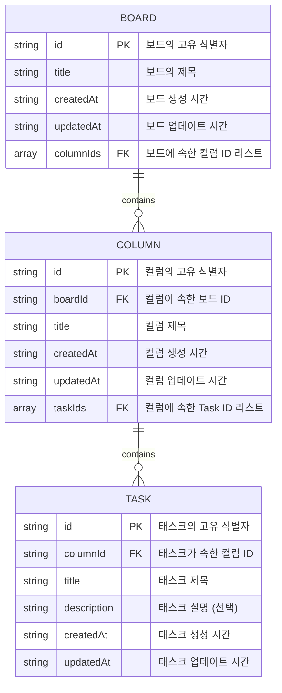

> [!NOTE]
>
> - 드래그앤드롭 가능한 칸반 보드
> - 데모 사이트: https://simple-kanban-iota.vercel.app

## 기술 스택

- **코어:** Next.js, TypeScript
- **상태 관리:** Zustand
- **UI:** Shadcn
- **스타일링:** Tailwind CSS
- **린팅:** ESLint, Prettier
- **폼 관리:** React Hook Form, Zod
- **기타:** DnD Kit, Motion

## 주요 기능

1. 보드(Board): 추가, 삭제
2. 컬럼(Column): 추가, 삭제, 이름 변경
3. 작업(Task): 추가, 삭제, 이름/상세정보 변경
4. 컬럼/작업 드래그앤드롭 이동 (드롭 대상 영역 Placeholder 표시)
5. 보드 검색 커맨드 (헤더)
6. 모바일 대응

## 엔티티 관계 모델

ID 기반 참조 구조를 사용하여 엔티티 간 관계를 유지하면서 빠른 조회 성능을 보장한다. 각 엔티티는 고유한 `id`를 가지며 외래 키(boardId, columnId)를 사용하여 참조 무결성을 유지한다. 칸반 보드는 여러 개의 컬럼을 포함하며, 각 컬럼은 여러개의 태스크를 포함하는 계층적 구조를 가진다.

- `Record<TaskId, TaskFields>` 형태로 저장하면 O(1) 시간 복잡도로 데이터 조회 가능
- `boardId`, `columnId` 같은 FK를 사용하여 참조 무결성 보장
- 필요에 따라 `assigneeId`, `priority` 같은 필드를 쉽게 추가할 수 있음

## 참고 자료

- 칸반 디자인: https://kanban-app-jay.netlify.app
- 전역 폰트: [Pretendard](https://github.com/orioncactus/pretendard)
- 드래그앤드롭: [Dnd Kit Sortable](https://docs.dndkit.com/presets/sortable)
